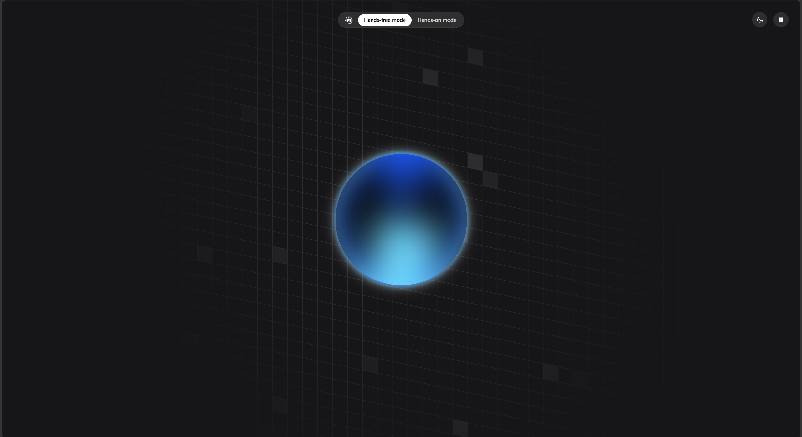
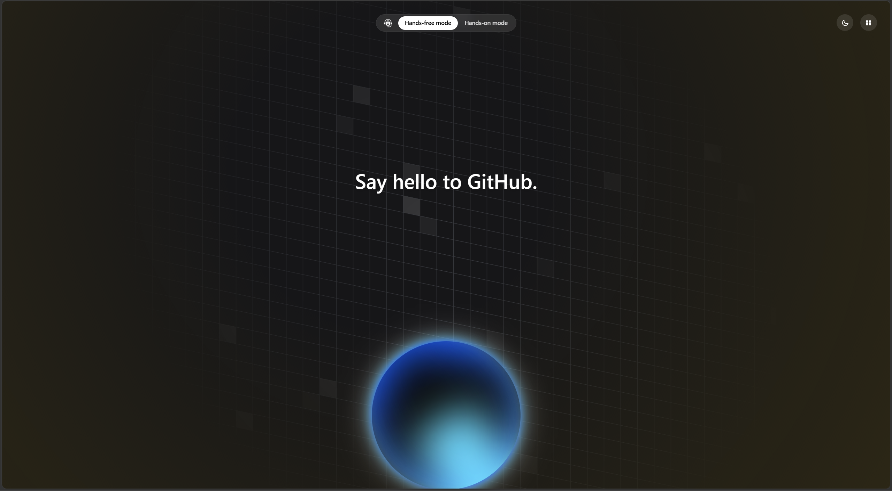
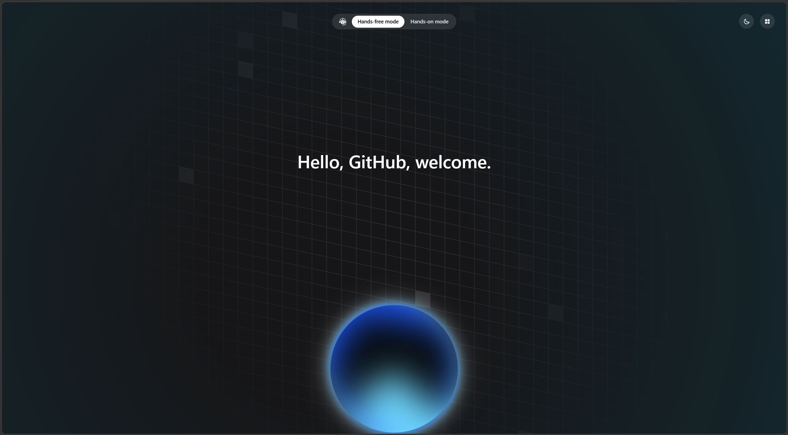

# Vayu (Versatile Artificial Intelligence, yet You-nique)

> Your personal AI operating system.
> An emotionally-aware, voice-first assistant, designed to think, remember, and assist naturally.

---

## Preview

### Idle State



---

### Listening State



---

### Talking State



---

# Vision

Ray isn't another chatbot.

The goal is to build an AI companion that feels present rather than reactive.

Instead of waiting for commands, Ray maintains context, understands emotion, remembers what matters, speaks naturally, and eventually becomes an operating layer for your digital life.

Long-term objectives include:

- Voice-first interaction
- Long-term memory
- Emotional intelligence
- Dynamic reasoning
- Tool execution
- Local-first privacy
- Multi-device synchronization
- Personalization over time

---

# Current Status

## Development Progress

| Phase | Status |
|--------|--------|
| Phase 1 — Foundation | ✅ Completed |
| Phase 2 — AI Runtime Pipeline | ✅ Completed |
| Phase 3 — Memory System | 🚧 Starting |
| Phase 4 — Emotional Intelligence | ⏳ Planned |
| Phase 5 — Proactive Intelligence | ⏳ Planned |
| Phase 6 — Full Assistant | ⏳ Planned |

Current milestone:

> **Beginning Phase 3 — Memory Architecture**

Based on the Deep Research document, the next focus is building persistent memory, retrieval pipelines, user modeling, and conversation continuity.

---

# Features (Current)

- Voice interface
- Animated Orb UI
- AI Runtime Pipeline
- Dynamic Context Builder
- Conversation State Management
- Streaming Responses
- Modular Architecture
- Tracing & Observability
- Provider Abstraction
- Prompt Assembly Pipeline

---

# Planned Features

- Long-term Memory
- Emotional State Engine
- Relationship Modeling
- Daily Briefings
- Proactive Suggestions
- Calendar Awareness
- Email Integration
- Knowledge Graph
- Multi-Agent System
- Local LLM Support
- Vision
- Mobile Companion
- Smart Home Control

---

# Tech Stack

**Frontend**
- Next.js
- React
- TypeScript
- TailwindCSS
- Framer Motion

**Backend**
- FastAPI
- Python
- OpenAI API
- LangGraph
- Pydantic

**Infrastructure**
- Docker
- Redis
- PostgreSQL
- Vector Database (planned)

---

# Project Structure

```
ray/

├── apps/
│   ├── api/
│   │   ├── app/
│   │   │   ├── api/
│   │   │   ├── core/
│   │   │   ├── context/
│   │   │   ├── memory/          (Phase 3)
│   │   │   ├── prompts/
│   │   │   └── llm/
│   │   └── tests/
│   └── web/
│       ├── src/
│       └── public/
│
├── packages/
│   ├── config/
│   ├── prompts/
│   ├── sdk/
│   ├── types/
│   └── ui/
│
├── docs/
│   ├── deep-research-document.md
│   ├── architecture.md
│   └── roadmap.md
│
├── assets/
│
└── README.md
```

---

# Getting Started

## Requirements

- Python 3.12+
- Node.js 22+
- pnpm
- Git

---

## Clone

```bash
git clone https://github.com/NeelakshSaxena/Vayu.git
cd Vayu
```

---

## Backend Setup

Create a virtual environment.

```bash
python -m venv .venv
```

Activate it.

**Windows**

```bash
.venv\Scripts\activate
```

**Linux/macOS**

```bash
source .venv/bin/activate
```

Install dependencies.

```bash
cd apps/api
pip install -r requirements.txt
```

---

## Frontend Setup

```bash
cd apps/web
pnpm install
```

---

## Environment Variables

Create `.env` files in `apps/api` and `apps/web`.

Example:

```env
VITE_OPEN_ROUTER_KEY=
VITE_SARVAM_API_KEY=
OPENAI_API_KEY=
MODEL=gpt-4o
DATABASE_URL=
REDIS_URL=
VECTOR_DB_URL=
```

---

# Running the Project

**Backend**

```bash
cd apps/api
uvicorn app.main:app --reload
```

**Frontend**

```bash
cd apps/web
pnpm dev
```

---

# Architecture

```text
Voice
  ↓
Speech-to-Text
  ↓
Context Builder
  ↓
Runtime Pipeline
  ↓
LLM
  ↓
Tool Calls
  ↓
Memory (Phase 3)
  ↓
Response
  ↓
Text-to-Speech
  ↓
Orb Animation
```

---

# AI Runtime

Current runtime includes:

- Prompt Assembly
- Dynamic Context Builder
- Conversation State
- Structured Tracing
- Modular Providers
- Streaming
- Response Pipeline

Phase 3 expands this with:

- Semantic Memory
- Episodic Memory
- Retrieval
- Memory Ranking
- User Profile
- Memory Consolidation

---

# Roadmap

## Phase 1
- Project foundation
- Voice pipeline
- UI prototype
**Completed ✅**

---

## Phase 2
- Runtime pipeline
- Context builder
- Observability
- Modular architecture
**Completed ✅**

---

## Phase 3 (Current)
Building the memory system.

Goals include:
- Persistent memory
- Retrieval engine
- Memory graph
- User profile
- Conversation continuity
- Reflection
- Memory scoring
- Compression
- Search

---

## Future

**Phase 4**: Emotion Engine
**Phase 5**: Proactive Assistant
**Phase 6**: Full Personal AI

---

# Documentation

Project documentation lives inside `/docs`.

Important files:

- `deep-research-document.md`
- `architecture.md`
- `roadmap.md`

---

# Contributing

Contributions are welcome.

Before opening a PR:

- Follow existing code style.
- Write tests where applicable.
- Keep commits focused.
- Document significant architectural changes.

---

# Inspiration

Ray draws inspiration from:

- J.A.R.V.I.S.
- Iron Man
- Her
- Samantha
- Modern AI research
- Human-computer interaction

---

# Philosophy

The objective isn't to build a chatbot.

The objective is to build software that understands people.

Every feature should answer one question:

> "Does this make Ray feel more like a trusted companion than a tool?"

---

# License

MIT License
