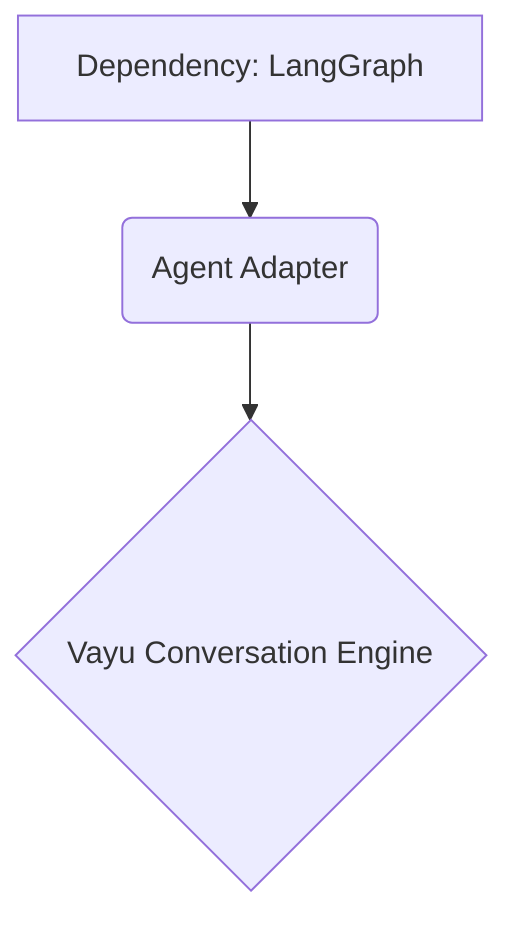

# Phase 1: Migration to New Architecture - Detailed Report

## Executive Summary

As part of the strategic migration to Vayu's new Open-Source-First architecture, **Phase 1 (Select Existing Agent Technology)** has been successfully completed. 

In alignment with the core principle—*"Do not spend six weeks building infrastructure that an open-source project already spent two years building. Spend those six weeks making Vayu better"*—we have selected and integrated **LangGraph** as our primary stateful agent runtime.

This report details the evaluation process, the final technology selection, the infrastructure updates, and the transition plan for Phase 2.

---

## 1. Technology Evaluation

The primary goal of Phase 1 was to avoid building a custom agent loop. The following mature open-source frameworks were evaluated:

| Framework | Primary Strengths | Outcome |
| :--- | :--- | :--- |
| **LangGraph** | Stateful execution, graph-based workflows, robust checkpointing, and native human-in-the-loop support. | **Selected as Primary Runtime** |
| **OpenHands** | Autonomous execution, complex execution environments. | Reserved as an architectural reference for long-running behavior and event systems. |
| **smolagents** | Simple agent loops, lightweight abstractions. | Too minimal for Vayu's long-term multi-step requirements. |
| **CrewAI** | Multi-agent orchestration, role delegation. | Reserved for future evaluation (Phase 7) if multi-agent swarms become necessary. |
| **Letta** | Persistent memory, long-lived agent state. | Reserved for memory architecture evaluation (Phase 4). |

---

## 2. Rationale for LangGraph

LangGraph was selected because it natively fulfills the most critical requirements for Vayu's background tasks and conversational agents:

1. **Stateful Graph Execution:** Vayu's conversation engine naturally operates as a sequence of discrete events (Plan -> Act -> Observe -> Continue). LangGraph's node/edge architecture perfectly models this.
2. **Resumability & Checkpointing:** A core requirement for Phase 5 (Background Tasks) is the ability to pause a task, wait for human approval, and resume. LangGraph's built-in checkpointer handles this state persistence out of the box.
3. **Ecosystem Compatibility:** It easily integrates with existing `langchain-core` abstractions, which standardizes our tool definitions (Phase 3) and memory integration (Phase 4).

---

## 3. Infrastructure Updates

To physically implement Phase 1 without disrupting the existing codebase, we updated the project's dependency specifications.

### Modifications Made:
*   **`apps/api/requirements.txt`**: Added `langgraph>=0.2.14` and `langchain-core>=0.2.39`.
*   **Virtual Environment**: Verified the local Windows Python `venv` and successfully installed the new dependencies using `pip`. 

The current environment is now fully primed with the necessary runtime libraries to begin integration.

---

## 4. Alignment with Vayu Architecture

The selection ensures we adhere to the **Technology Reuse Policy**:

*   **No Forking:** We are using the standard LangGraph library.
*   **No Bleeding Abstractions:** In the upcoming phases, LangGraph will be wrapped in an **Agent Adapter**. The rest of the Vayu codebase (like `AIRuntimePipeline`) will not know that LangGraph exists; it will only see Vayu's standard Conversation Events.

---

## 5. Next Steps: Transitioning to Phase 2

With the technology selected and installed, we are ready for **Phase 2 (Integrate Agent Runtime with Conversation Engine)**. 

### Phase 2 Objectives:
1.  **Create the Agent Adapter:** Build a translation layer that converts Conversation Engine context into a LangGraph state graph.
2.  **Event Translation:** Map LangGraph execution events (e.g., tool started, token generated) into Vayu's existing streaming WebSocket protocol.
3.  **Preserve the Canonical Runtime:** Ensure that `origin/conversation-engine` remains the primary entry point for all user interactions.
